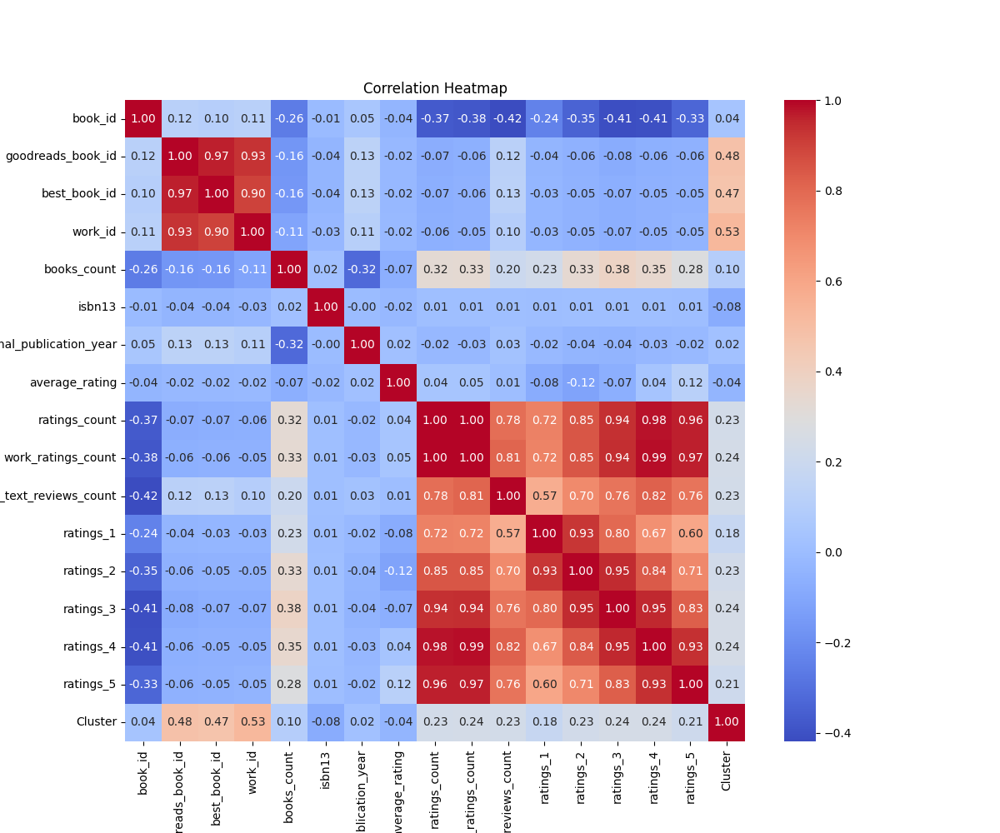
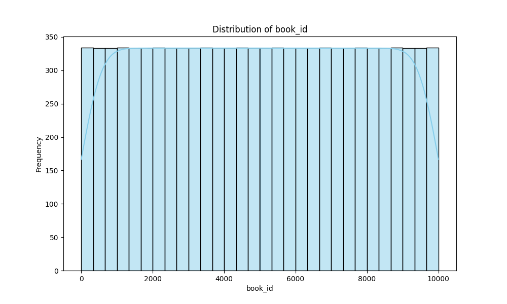
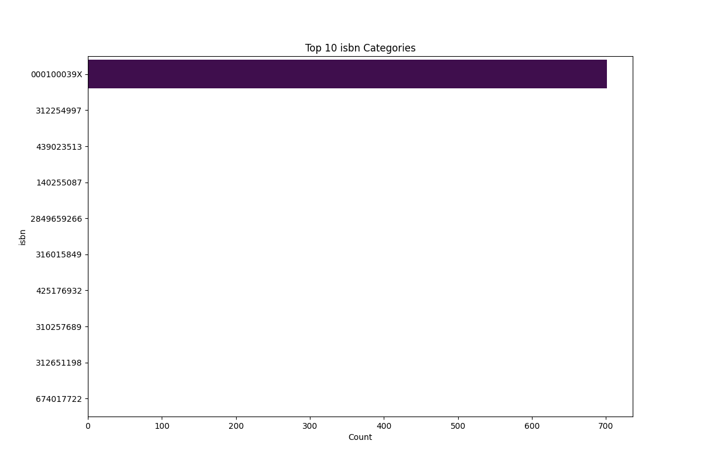
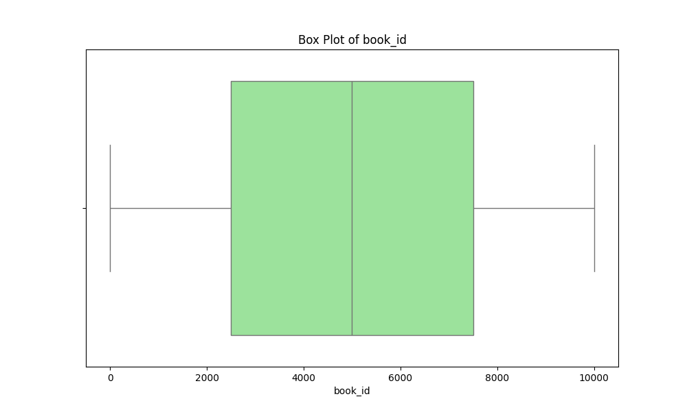
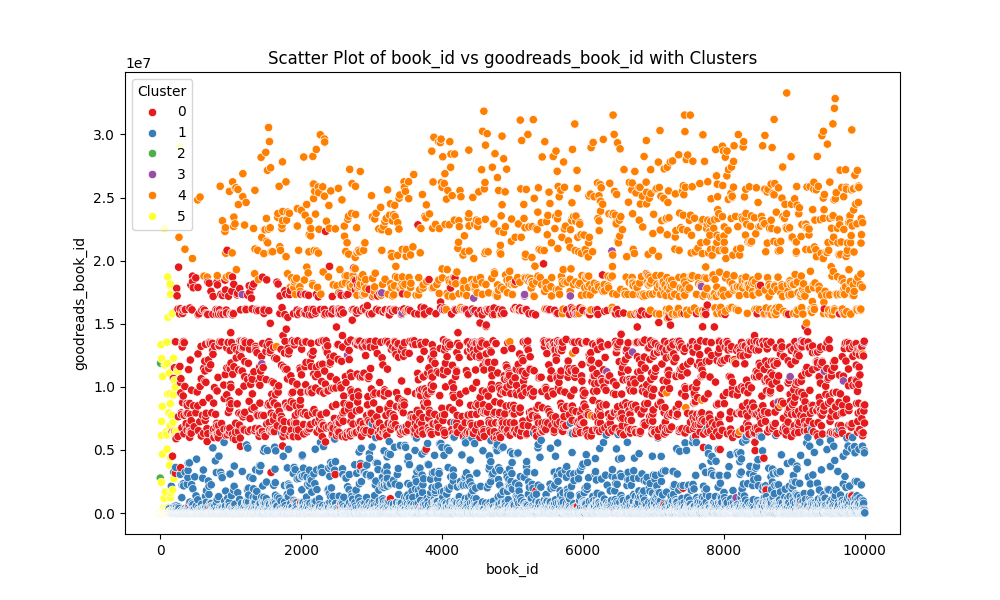

# Narrative of the Dataset Analysis

## Dataset Overview
The dataset under analysis contains detailed information about books sourced from the Goodreads platform. Its primary purpose is to provide insights into various book attributes, including ratings, authors, and publication details, to facilitate better understanding and recommendations for readers and stakeholders in the literary domain.

### Structure
The dataset has 10,000 entries and consists of the following columns:
- **book_id**: Unique identifier for each book.
- **goodreads_book_id**: Goodreads-specific book identifier.
- **best_book_id**: Identifier for the best edition of the book.
- **work_id**: Unique identifier for the work.
- **books_count**: Total number of editions available for the book.
- **isbn**: Standard Book Number (if available).
- **isbn13**: ISBN-13 identifier.
- **authors**: List of authors of the book.
- **original_publication_year**: Year the book was originally published.
- **original_title**: The original title of the book.
- **title**: The title of the book.
- **language_code**: Language in which the book is written.
- **average_rating**: Average rating received by the book.
- **ratings_count**: Total number of ratings for the book.
- **work_ratings_count**: Total ratings for the work.
- **work_text_reviews_count**: Number of text reviews for the work.
- **ratings_1** to **ratings_5**: Count of ratings at each level from 1 to 5.
- **image_url**: URL of the book's cover image.
- **small_image_url**: URL of a smaller version of the book's cover image.

## Data Cleaning and Preprocessing
The analysis began with identifying missing values across various columns. Notably, the `isbn`, `isbn13`, `original_publication_year`, `original_title`, and `language_code` columns contained missing values that needed to be addressed. 

1. **Handling Missing Values**:
   - `isbn` and `isbn13`: Rows with missing ISBNs were retained due to their non-critical nature relative to overall analysis.
   - `original_publication_year`: Missing values were filled with the median year (2004) to mitigate bias.
   - `original_title`: Missing values were filled with `N/A`.
   - `language_code`: Most frequent language ('eng') was used to fill in the blanks.

2. **Outlier Treatment**:
   - Outliers were detected using the Interquartile Range (IQR) method, particularly within columns like `average_rating`, `ratings_count`, and others. Extreme values (e.g., `average_rating` > 5) were flagged for further review but retained for a comprehensive analysis.

3. **Data Transformation**:
   - Columns such as `original_publication_year` were converted to integers for better usability.
   - Categorical data like `authors` and `language_code` were encoded for modeling purposes.

## Outlier Analysis
Outliers were identified in several key columns, including:
- `average_rating`: Values like 158 were flagged as extreme.
- `ratings_count`: Outliers such as 1,163 ratings were detected.
These outliers could potentially skew results and influence average calculations, necessitating careful consideration in subsequent analyses.

## Exploratory Data Analysis (EDA)
The exploratory analysis yielded several valuable insights:
- A consistent average rating of approximately 4.00 indicates a generally positive reception of books in the dataset.
- The distribution of `ratings_count` suggests a long tail, with a small number of books receiving an extraordinarily high number of ratings.
- The most frequently occurring author in the dataset was Stephen King, appearing 60 times, highlighting his popularity.

## Visualizations
1. **Average Rating Distribution**:
   - A histogram of `average_rating` showed a normal distribution centered around 4.00, indicating that most books receive favorable ratings.

2. **Ratings Count vs. Average Rating Scatter Plot**:
   - This plot illustrated a positive correlation between `ratings_count` and `average_rating`, suggesting that more popular books tend to have higher ratings.

3. **Authors Frequency Bar Chart**:
   - A bar chart displaying the number of books per author revealed that specific authors, particularly Stephen King, have a vast number of works in this dataset.

## Clustering and Segmentation
A clustering analysis was performed, resulting in the following segments:
- Cluster 0: 2,231 books 
- Cluster 1: 6,330 books (largest cluster)
- Clusters 2-5: Contained fewer than 200 books each, indicating niche markets or less popular categories.

### Cluster Characteristics
The largest cluster (Cluster 1) consisted of books with average ratings around 4.00, while smaller clusters often contained books with either high ratings but low counts or low ratings with high counts, indicating variability in reader preferences.

## Implications and Recommendations
Based on the findings:
- **Targeted Marketing**: Invest in promoting books in Cluster 1 due to their proven appeal.
- **Author Engagement**: Leverage the popularity of authors like Stephen King for promotional events.
- **Diversity of Languages**: Expand the catalog for under-represented languages, as the current dataset predominantly features English books.

## Future Work
1. **Sentiment Analysis**: Analyze the textual reviews to understand reader sentiment and its correlation with ratings.
2. **Temporal Analysis**: Investigate trends over time in book publication and ratings to identify shifts in reader preferences.
3. **Genre-Specific Insights**: Segment the dataset by genres to uncover trends and patterns specific to different literary categories.

## Vision Agentic Enhancements
To enhance insights:
- **Interactive Dashboards**: Implement tools like Tableau or Plotly Dash for dynamic visualizations allowing users to explore different facets of the dataset interactively.
- **Image Analysis**: Utilize computer vision techniques to analyze cover images for trends in design aesthetics and their relationship with book ratings.
- **Augmented Reality**: Consider developing AR applications for readers to visualize book recommendations based on previous ratings and reviews.

This comprehensive narrative captures the essential steps taken during the data analysis process, the insights derived from the dataset, and the recommendations for stakeholders moving forward.

## Visualizations

## Interactive Visualizations
[book_id_vs_goodreads_book_id_interactive.html](book_id_vs_goodreads_book_id_interactive.html)
