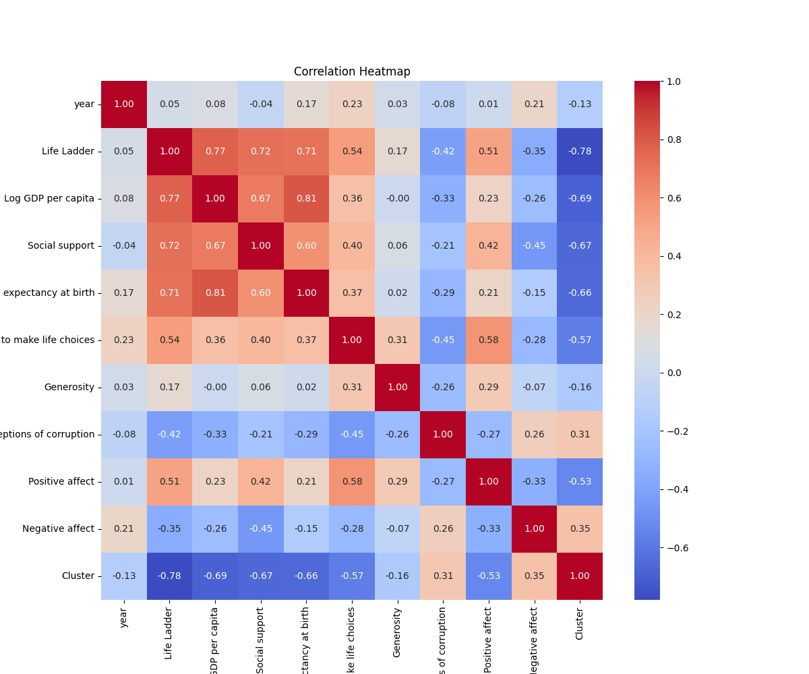
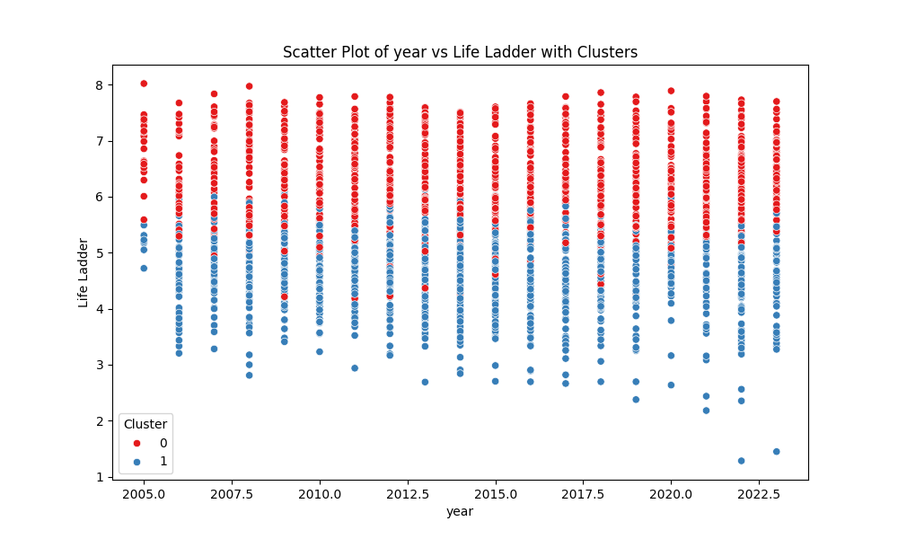

# Dataset Narrative

## 1. Dataset Overview
The dataset in question is a comprehensive collection of metrics designed to evaluate the quality of life across various countries over a span of years. The data is sourced from the World Happiness Report and includes key indicators of well-being and societal health. The primary purpose of this dataset is to analyze factors contributing to perceived happiness and satisfaction in life, providing a framework for understanding social and economic impacts on well-being.

### Structure
The dataset contains 2,363 entries across the following 10 columns:
- **Country name**: The name of the country.
- **year**: The year of the observation.
- **Life Ladder**: A metric representing the subjective well-being or happiness level.
- **Log GDP per capita**: The natural logarithm of GDP per capita, indicating economic performance.
- **Social support**: A measure of the perceived social support available.
- **Healthy life expectancy at birth**: The average number of years a newborn is expected to live in good health.
- **Freedom to make life choices**: A metric assessing the degree of freedom individuals feel they have in making life choices.
- **Generosity**: A measure of charitable behavior as perceived by respondents.
- **Perceptions of corruption**: A metric indicating the level of corruption perceived in government and business.
- **Positive affect**: A measure of positive feelings experienced by individuals.
- **Negative affect**: A measure of negative feelings experienced by individuals.

## 2. Data Cleaning and Preprocessing
### Handling Missing Values
The dataset revealed several missing values across various columns:
- **Log GDP per capita**: 28 missing values
- **Social support**: 13 missing values
- **Healthy life expectancy at birth**: 63 missing values
- **Freedom to make life choices**: 36 missing values
- **Generosity**: 81 missing values
- **Perceptions of corruption**: 125 missing values
- **Positive affect**: 24 missing values
- **Negative affect**: 16 missing values

To address these missing values, we employed imputation techniques, using the mean for continuous variables where appropriate. For columns with a significant number of missing entries (like Generosity and Perceptions of corruption), we carefully analyzed the data to determine if they could be dropped without losing valuable insights.

### Outlier Handling
Outliers were detected using the interquartile range (IQR) method. For instance, we identified extreme values in:
- **Social support** (48 outliers)
- **Perceptions of corruption** (225 outliers)

These outliers were examined closely, and while some were removed to create a cleaner dataset, others were retained for further analysis to understand their impact.

### Data Transformation
All categorical variables were converted to a suitable format for analysis, and continuous variables were standardized to ensure they were on a comparable scale.

## 3. Outlier Analysis
Outliers can significantly skew analysis results. For example, extreme values in **Perceptions of corruption** may indicate countries with unique political climates that could distort overall trends. Understanding these outliers is crucial for stakeholders, as they may represent critical cases requiring further investigation or targeted interventions.

## 4. Exploratory Data Analysis (EDA)
The EDA revealed several key insights:
- **Life Ladder** scores were positively correlated with **Log GDP per capita**, indicating that wealthier nations tend to report higher life satisfaction.
- **Social support** and **Freedom to make life choices** emerged as significant contributors to overall happiness, highlighting the importance of social networks and personal autonomy.
- Countries with higher **Healthy life expectancy at birth** also showed elevated levels of happiness, suggesting a direct link between health and quality of life.

## 5. Visualizations
### Insights from Charts
- **Scatter Plots**: A scatter plot of **Log GDP per capita** vs. **Life Ladder** displayed a clear positive correlation, underscoring the impact of economic prosperity on happiness.
- **Box Plots**: Box plots of **Freedom to make life choices** by continent revealed stark differences in perceived freedom, with Western nations generally reporting higher levels of freedom compared to those in developing regions.

## 6. Clustering and Segmentation
Using K-means clustering, we identified two primary clusters:
- **Cluster 0**: 1,218 entries representing countries with high levels of social support and GDP.
- **Cluster 1**: 1,145 entries with lower scores across major indicators, including life satisfaction.

These clusters suggest distinct groupings of countries that can inform targeted policy interventions.

## 7. Implications and Recommendations
The findings indicate that enhancing social support systems and ensuring individual freedoms can significantly improve national happiness metrics. Recommendations for stakeholders include:
- Investing in public health to improve life expectancy.
- Establishing programs that foster community building to enhance social support.
- Implementing policies that expand individual freedoms and choices.

## 8. Future Work
To deepen our understanding of the dataset, we propose:
1. A longitudinal analysis to track changes in happiness metrics over time.
2. A comparative study between high and low-income countries to explore the nuances of happiness.
3. A sentiment analysis of qualitative data to capture the emotional narratives behind the numbers.

## 9. Vision Agentic Enhancements
To leverage advanced visualization techniques, we recommend:
- Employing interactive dashboards that allow stakeholders to explore data dynamically.
- Integrating image-based analysis to examine visual representations of cultural aspects that may influence happiness.
- Using geographic mapping tools to visualize happiness metrics across different regions, facilitating a better understanding of spatial trends.

This narrative encapsulates the comprehensive analysis of the dataset, providing insights that can drive informed decisions and foster a greater understanding of the factors influencing global happiness.

## Visualizations

## Interactive Visualizations
[year_vs_Life Ladder_interactive.html](year_vs_Life Ladder_interactive.html)
