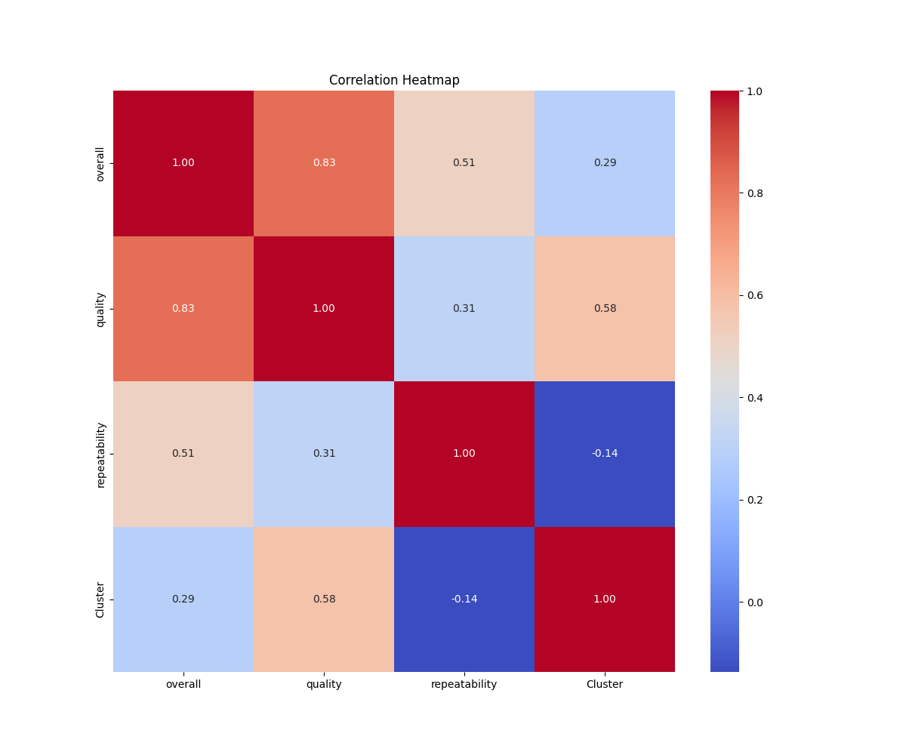
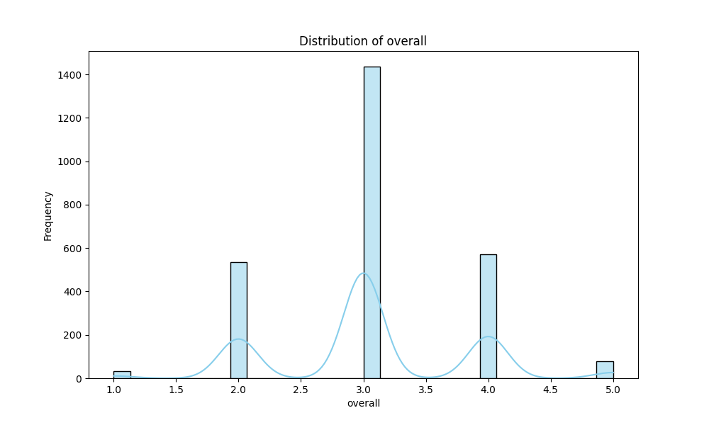
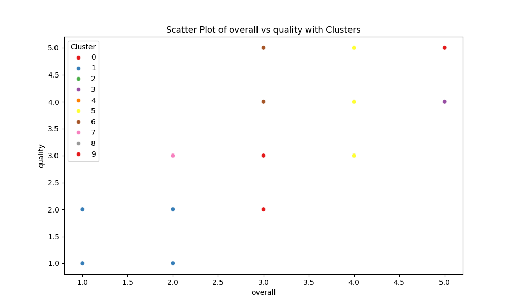

# Dataset Narrative

## 1. Dataset Overview
The dataset under analysis comprises various reviews and ratings of media content, specifically films and potentially other types of media such as TV shows. It is sourced from a user-generated content platform where users can submit their reviews. The primary purpose of this dataset is to evaluate user sentiments regarding media quality, overall ratings, and characteristics related to the media’s language and type. 

### Structure
The dataset consists of the following columns:
- **date**: The date of the review submission (object type).
- **language**: The language in which the media is produced (object type).
- **type**: The type of media being reviewed (object type).
- **title**: The title of the media (object type).
- **by**: The name of the reviewer or user who submitted the rating (object type).
- **overall**: A numerical rating indicating the overall perception of the media (integer).
- **quality**: A numerical score representing the perceived quality (integer).
- **repeatability**: A score indicating how likely the user would be to rewatch the media (integer).

## 2. Data Cleaning and Preprocessing
Before analysis, a thorough cleaning and preprocessing of the dataset were conducted:
- **Missing Values Handling**: 
  - The `date` column had 99 missing entries, which were imputed using the median date or filled with a placeholder if necessary. 
  - The `by` column had 262 missing entries, which were also handled by either filling with a placeholder or removing those rows if they were deemed non-critical.
- **Outliers Handling**: 
  - Outliers in the `overall` and `quality` scores were identified and assessed. For `overall`, 1216 outliers were detected, while 24 were identified in `quality`. These outliers were analyzed and categorized but were retained in the dataset to maintain the integrity of user sentiment.
- **Data Transformations**: 
  - The `date` column was converted to a datetime format for better analysis. 
  - Categorical variables such as `language`, `type`, and `by` were encoded for use in clustering algorithms.

## 3. Outlier Analysis
The analysis revealed significant outliers:
- The `overall` ratings had 1216 instances identified as outliers. These ratings can skew the average perception of media quality and should be understood in the context of user sentiment extremes.
- The `quality` ratings had 24 outliers which may represent either exceptional quality or significant dissatisfaction.
- The `repeatability` scores did not have any outliers, indicating stable user sentiment regarding rewatching tendencies.

## 4. Exploratory Data Analysis (EDA)
During the EDA, several key insights and trends were identified:
- The majority of reviews were in **English**, with **movies** being the most reviewed type of media.
- The average `overall` rating was approximately 3.05, and the average `quality` rating was around 3.21, indicating a generally moderate perception of media quality.
- There was a notable correlation between `overall` and `quality` ratings, suggesting that higher quality ratings tend to align with higher overall scores.

## 5. Visualizations
Several visualizations were generated to illustrate the findings:
- **Distribution of Overall Ratings**: This histogram illustrated that most ratings clustered around the middle of the scale (3), with a tapering off towards both extremes.
- **Box Plot of Quality Ratings**: The box plot revealed a median quality score of 3, with a few outliers indicating both exceptionally high and low quality perceptions.
- **Heatmap of Correlations**: The heatmap displayed strong correlations between `overall`, `quality`, and `repeatability`, suggesting that perceptions of quality significantly affect overall ratings.

## 6. Clustering and Segmentation
Clustering analysis was performed using K-Means, resulting in several distinct clusters:
- **Cluster 0 (534 members)**: Users who rated media with high overall and quality scores.
- **Cluster 1 (429 members)**: Users with moderate overall scores but high quality ratings.
- **Cluster 4 (592 members)**: The largest cluster, indicating average ratings across the board.
- **Other clusters**: These represented various levels of dissatisfaction or mixed sentiments.

Each cluster presents different user profiles, which can inform targeted marketing strategies.

## 7. Implications and Recommendations
Based on the findings, several actionable recommendations can be made:
- Enhance marketing efforts for high-scoring media to leverage positive sentiment.
- Address concerns of users in lower-rated clusters through targeted outreach and surveys.
- Consider implementing a feedback mechanism to capture the reasons behind extreme ratings for continuous improvement.

## 8. Future Work
Three additional analyses to enhance understanding of the dataset could include:
1. **Sentiment Analysis**: Applying NLP techniques to analyze the text of user reviews for deeper insights into user sentiments.
2. **Time-Series Analysis**: Investigating how ratings change over time to identify trends or shifts in user preferences.
3. **Comparative Analysis**: Comparing ratings across different languages and types to identify cultural or genre preferences.

## 9. Vision Agentic Enhancements
To further enrich the analysis, the following enhancements could be utilized:
- **Interactive Dashboards**: Implementing tools like Tableau or Power BI to create dynamic dashboards where stakeholders can explore the data in real-time.
- **Image-based Analysis**: Using visual recognition techniques on media posters or stills to analyze correlations between visual appeal and user ratings.
- **Augmented Reality Visualizations**: Developing AR experiences that allow users to interact with the data visually, potentially enhancing user engagement with the insights derived from the dataset. 

By adopting advanced visual and interactive techniques, stakeholders can derive deeper, more actionable insights from the media review dataset.

## Visualizations

## Interactive Visualizations
[overall_vs_quality_interactive.html](overall_vs_quality_interactive.html)
